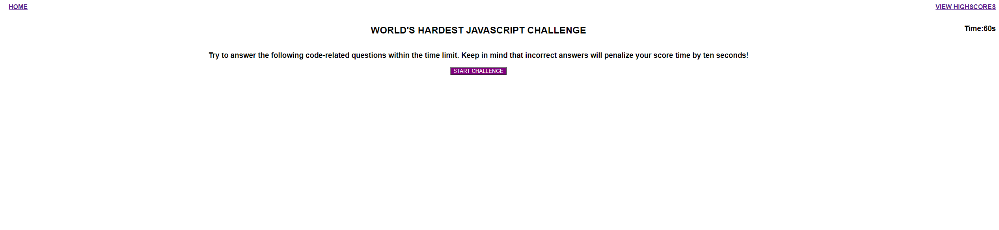

# Code-Quiz
This project is a webpage featuring a timed quiz based on JavaScript knowledge. The technologies I used in order to build this project were: HTML, CSS, and Javascript. I enjoyed learning about how JavaScript uses functions to proccess user data and react to inputs. I created quite a few different functions, such as functions to switch the questions when the user clicks an answer and also a function to detect if the answer selected is right or wrong

## Screenshot

## Link
https://jaredinyaagha1.github.io/Code-Quiz/